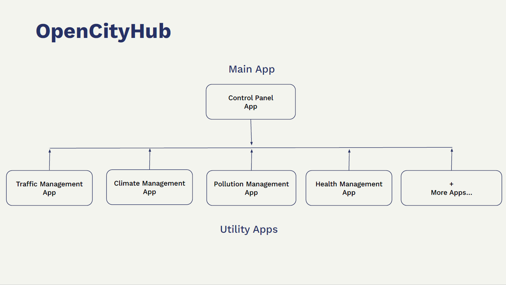
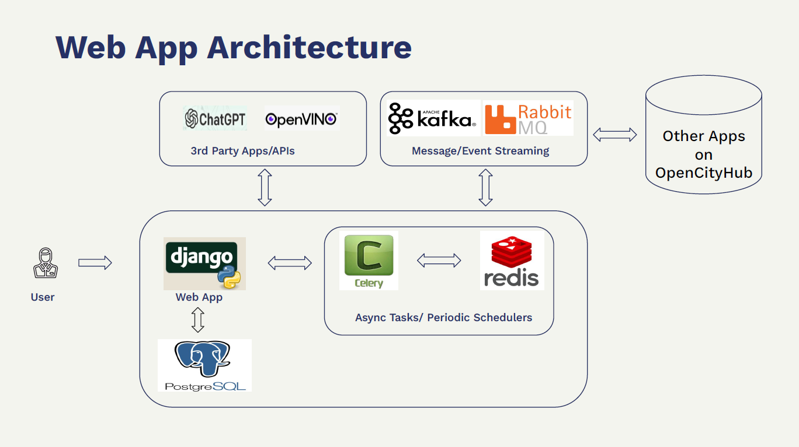
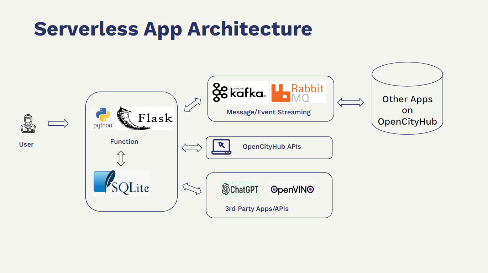
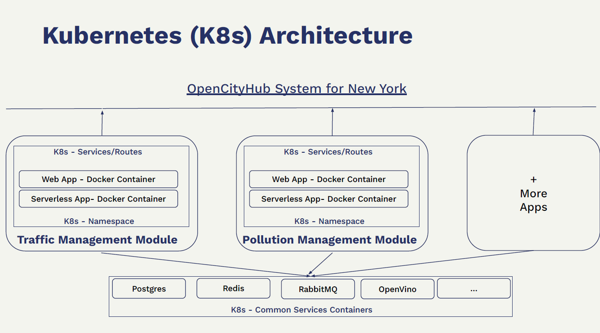

# OpenCityHub

Kubernetes-native smart city management system that is scalable, cost-efficient and fault tolerant. It is designed as a set of microservices and serverless apps built on top of the RedHat OpenShift platform.

Our platform has a central panel app, and a set of utility apps for different use cases like traffic management, climate management, eGov management, emergency incident management, and so on. Each utility app also contains useful function-as-serverless-apps like multi-model city travel planner for citizens, license checking app for police, etc.


## Why Kubernetes & OpenShift

Smart city management requires various applications, each with unique resources and fluctuating demands. To address this, we've developed microservices and serverless applications that can be deployed using Docker containers and Kubernetes. Any city or town can deploy and scale these applications as per their requirements.


## Project Structure
```
OpenCityHub
├── k8s_config
│   ├── control_panel_app_configs
│   ├── traffic_mgmt_app_configs
│   ├── traffic_mgmt_serverless_configs
│   └── ....
└── smartcity_apps
    ├── city_gpt
    │   ├── k8s_config
    │   └── serverless_apps
    │   └── web_app
    ├── climate_mgmt
    │   ├── k8s_config
    │   ├── serverless_apps
    │   └── web_app
    ├── control_panel
    │   ├── k8s_config
    │   ├── serverless_apps
    │   └── web_app
    ├── e_gov_mgmt
    │   ├── k8s_config
    │   ├── serverless_apps
    │   └── web_app
    ├── emergency_incident_mgmt
    │   ├── k8s_config
    │   ├── serverless_apps
    │   └── web_app
    ├── energy_mgmt
    │   ├── k8s_config
    │   ├── serverless_apps
    │   └── web_app
    ├── health_emergency_mgmt
    │   ├── k8s_config
    │   ├── serverless_apps
    │   └── web_app
    ├── pollution_mgmt
    │   ├── k8s_config
    │   ├── serverless_apps
    │   └── web_app
    ├── public_events_mgmt
    │   ├── k8s_config
    │   ├── serverless_apps
    │   └── web_app
    ├── public_safety_mgmt
    │   ├── k8s_config
    │   ├── serverless_apps
    │   └── web_app
    └── traffic_mgmt
        ├── k8s_config
        ├── serverless_apps
        └── web_app

```

## Architectural Diagrams












## How To Deploy

**Tradeoffs for Proof-of-Concept building**

**Note:** Currently, Traffic Management App & Control Panel Apps are functional.

**Note:** We use dummy/mock data for graphs, API calls to showcase apps as proof-of-concept.

**Note:** We don't use persistent volume as its access was not available in OpenShift Sandbox clusters.

**Note:** We don't use opaque/secret for credentials as of now and simply use configmap.


#### Docker Images
We've provided readymade docker images at Quay.io like: 
- https://quay.io/repository/aenvsite/control_panel
- https://quay.io/repository/aenvsite/traffic_management
- https://quay.io/repository/aenvsite/traffic_citizen_travel_planner
- https://quay.io/repository/aenvsite/traffic_license_checker

However, you can build your own by using `Dockerfile` at respective app like `./smartcity_apps/control_panel/web_app`

We'll deploy two apps for demo purpose, whose config files are given in `k8s_config` folder at root.

#### Deploying "Control Panel App":

Major parts involved:

- Modifying config values
- (Optional) Creating own docker images using Dockerfile and source code at `./smartcity_apps/control_panel/web_app/Dockerfile`
- Login to OpenShift using `oc login`
- Executing each component's deployment/service configuration commands one by one.
- Creating routes for public facing components like Django app
- (Optional) Deploying serverless applications using respective commands.

**Steps for App:**

1. Go to directory `./k8s_configs/control_panel_app_configs` at root.
2. Modify config key/values in file `k8s-configmap.yaml`
3. Deploy configs: `kubectl apply -f k8s-configmap.yaml`
4. Deploy Postgres DB: `kubectl apply -f k8s-postgres-deploy.yaml`
5. Create an associated service for PostgresDB: `kubectl apply -f k8s-postgres-service.yaml`
6. Deploy Redis instance: `kubectl apply -f k8s-redis-deploy.yaml`
7. Create an associated service for Redis: `kubectl apply -f k8s-redis-service.yaml`
8. Create an associated service for Celery app: `kubectl apply -f k8s-celeryapp-service.yaml`
9. Deploy 'Control Panel' Celery app: `kubectl apply -f k8s-celeryapp-deploy.yaml`
10. Deploy 'Control Panel' RabbitMQ Consumer app: `kubectl apply -f k8s-rabbitmq-deploy.yaml` (Note: Currently, you need to supply full AMPQS URI in configmap, as we're not deploying it on OpenShift, but using a free 3rd party service like https://cloudamqp.com)
11. Create an associated service for RabbitMQ Consumer app: `kubectl apply -f k8s-rabbitmq-service.yaml`
12. Deploy Django docker container for 'Control Panel' App: `kubectl apply -f k8s-django-deploy.yaml` (Note: you can build and use your own docker image)
13. Run a dummy/mock data loading Job (optional): `kubectl apply -f k8s-django-dummydata-job.yaml` (Note: this runs only once)
14. Create an associated service for Django app: `kubectl apply -f k8s-django-service.yaml`
15. Use OpenShift Web Dashboard to create a route for above Django service.


Now you should be able to access the 'Control Panel' app using Route created in step 15.

Also, if something doesn't work, look for particular container's logs in OpenShift Web Dashboard or open an issue on Github.


#### Deploying "Traffic Management App":

Major parts involved:

- Modifying config values
- (Optional) Creating own docker images using Dockerfile and source code at `./smartcity_apps/traffic_mgmt/web_app/Dockerfile`
- Login to OpenShift using `oc login`
- Executing each component's deployment/service configuration commands one by one.
- Creating routes for public facing components like Django app
- (Optional) Deploying serverless applications using respective commands.

**NOTE:** You can either use same common services like PostgreSQL, Redis instance or deploy seperately as per your use-case. For this demo, we're using different instances.

**Steps for App:**

1. Go to directory `./k8s_configs/traffic_mgmt_app_configs` at root.
2. Modify config key/values in file `k8s-configmap.yaml`
3. Deploy configs: `kubectl apply -f k8s-configmap.yaml`
4. Deploy Postgres DB: `kubectl apply -f k8s-postgres-deploy.yaml`
5. Create an associated service for PostgresDB: `kubectl apply -f k8s-postgres-service.yaml`
6. Deploy Redis instance: `kubectl apply -f k8s-redis-deploy.yaml`
7. Create an associated service for Redis: `kubectl apply -f k8s-redis-service.yaml`
8. Create an associated service for Celery app: `kubectl apply -f k8s-celeryapp-service.yaml`
9. Deploy 'Traffic Management' Celery app: `kubectl apply -f k8s-celeryapp-deploy.yaml`
10. Deploy 'Traffic Management' RabbitMQ Consumer app: `kubectl apply -f k8s-rabbitmq-deploy.yaml` (Note: Currently, you need to supply full AMPQS URI in configmap, as we're not deploying it on OpenShift, but using a free 3rd party service like https://cloudamqp.com)
11. Create an associated service for RabbitMQ Consumer app: `kubectl apply -f k8s-rabbitmq-service.yaml`
12. Deploy Django docker container for 'Traffic Management' App: `kubectl apply -f k8s-django-deploy.yaml` (Note: you can build and use your own docker image)
13. Run a dummy/mock data loading Job (optional): `kubectl apply -f k8s-django-dummydata-job.yaml` (Note: this runs only once)
14. Create an associated service for Django app: `kubectl apply -f k8s-django-service.yaml`
15. Use OpenShift Web Dashboard to create a route for above Django service.


Now you should be able to access the 'Traffic Management' app using Route created in step 15.

Also, if something doesn't work, look for particular container's logs in OpenShift Web Dashboard or open an issue on Github.


**Steps for Serverless Apps:**

**Note:** Serverless apps docker images are readily available on Quay.io but you can build your own using Dockerfile and source code in `./smartcity_apps/traffic_mgmt/serverless_apps`

1. Install Openshift Knative on your system.
2. For each app in `./smartcity_apps/traffic_mgmt/serverless_apps` run Knative command `kn service create <name-of-serverless-function> --image <docker-image> --port <port>` command
2. For example, run `kn service create traffic-citizen-travel-planner-app --image quay.io/aenvsite/traffic_citizen_travel_planner --port 5000` command to deploy 'citizen_travel_planner' app.
3. Access using the URL printed on command line once deployment is completed.


## License

Apache License, Version 2.0